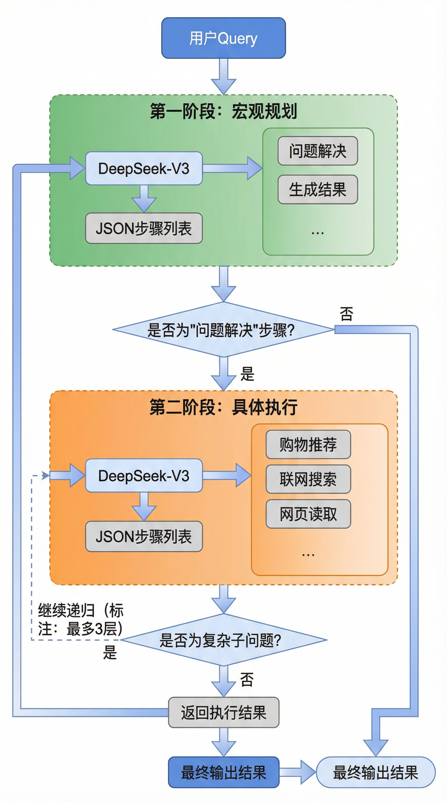
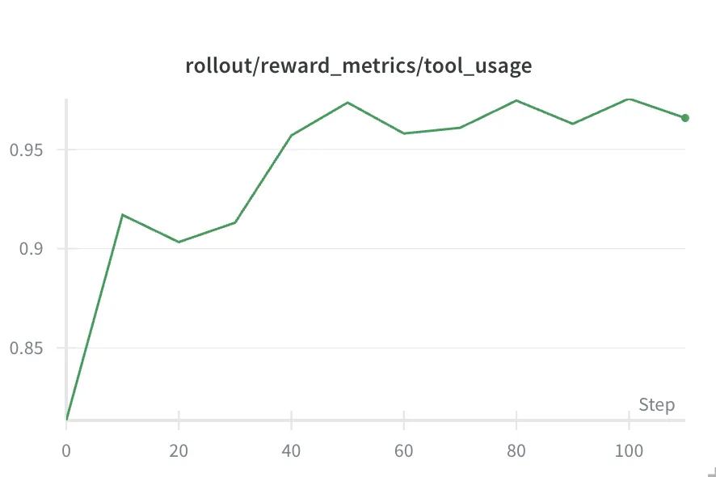

# 提升大模型 Agent 任务规划能力的两种技术路线：规划模型与端到端 Agentic 模型的对比与实践 

## 一、目标：提升大模型的 Agent 任务规划能力

### 1\.1 项目背景

我们在 **WeDeepSearch** 项目中构建了一个基于 DAG 调度的多智能体系统，用于购物助手等场景的落地探索。该系统支持将复杂任务自动拆解为多步执行计划，无依赖的步骤可并发调度，同时内置了任务规划、反思纠错、工具调用、人机追问等多种协作模式。在实际业务落地过程中，我们发现模型的**任务分解和规划能力**是整个系统效果的核心瓶颈——例如用户说"帮我找一款适合油皮的防晒霜，预算 100 以内，最好有近期优惠"，系统需要合理拆解出商品筛选、价格查询、优惠检索等子任务并编排执行顺序。因此我们围绕"如何提升大模型的 Agent 规划能力"做了一些研究和对比实验，这里把结论和实践经验分享给大家。

**体验链接**：[https://deepsearch\.woa\.com/](https://deepsearch.woa.com/)

**界面展示展示**： 


### 1\.2 背景与意义

随着大模型在自然语言理解、生成、代码编写等方面的能力持续提升，Agent 系统正成为 AI 应用落地的重要方向——使模型从单纯的问答工具进化为能够自主完成多步骤复杂任务的智能体。然而，当前大模型在**任务规划**方面仍存在明显不足：

- **任务拆解能力有限**：面对复杂任务时，模型难以生成合理的步骤序列，常出现关键环节遗漏或步骤间逻辑不连贯的问题。

- **缺乏动态调整能力**：生成的计划往往是静态的，执行过程中无法根据中间反馈进行自适应调整。

- **可解释性与自动化的平衡**：全自动化系统难以审查和干预，而可解释的系统又依赖人工介入，两者之间需要合理取舍。

提升任务规划能力，对自动化办公、流程管理等场景的实际落地具有直接价值。

### 1\.2 研究目标

本研究旨在提升大模型在 Agent 任务规划方面的能力，核心目标包括：

- **提升任务拆解能力**：使模型能够将复杂任务分解为结构化、可执行的步骤序列。

- **增强动态调整能力**：使模型在执行过程中能根据中间反馈调整规划，而非固守初始方案。

- **对比两种技术路线**：通过实验比较规划模型与端到端 Agentic 模型的优劣，为实际选型提供参考。

- **推动实际落地**：面向自动化流程、智能办公等场景提供可用方案；同时探索小尺寸模型（降低推理成本）和私有化部署（满足数据合规、低延迟需求）的可行性。

### 1\.3 研究成果概览

以下结果涵盖四个模型，分别代表两种技术路线的训练前后对比：

- **Qwen3\-32B**：32B 基座模型，未经 RL 训练，作为 Planning 路线的基线

- **Planning RL\-32B**：基于 Qwen3\-32B 进行 Planning RL 训练后的模型，专注于任务拆解与步骤规划

- **Qwen3\-8B**：8B 基座模型，未经 RL 训练，作为 Agentic 路线的基线

- **Agentic RL\-8B（110 步）**：基于 Qwen3\-8B 进行 Agentic RL 训练 110 步后的模型，具备自主搜索与多轮推理能力

**WorFBench（Average F1 Score，通用规划能力评测）**：

**评估集效果（BrowseComp\-Plus）**：


## 二、概念：任务规划与两种技术路线

### 2\.1 任务规划的定义与挑战

**任务规划**指将复杂目标拆解为一系列可执行的子任务或步骤，并合理安排其顺序与依赖关系。在智能体系统中，任务规划是实现自主决策和高效执行的基础。

主要挑战包括：任务理解与抽象、步骤合理性与可执行性、**粒度控制**（过粗则执行器难以落地，过细则步骤爆炸且易冗余）、以及执行过程中的**动态调整能力**（依赖中间反馈而非静态计划）。

### 2\.2 Agentic 模型与 ReACT 模式

**Agentic 模型**是指具备自主规划、决策与执行能力的智能体模型——不仅能理解任务，还能主动调用工具、处理中间反馈、动态调整行为，从而实现端到端的任务完成流程。

**ReACT（Reason \+ Act）模式**将推理与行动交织在一起：每一步先分析当前状态和任务需求，再执行工具调用或操作，获取反馈后继续调整后续计划，如此迭代直至任务完成。典型流程为：分析当前状态 → 决定下一步行动 → 调用工具 → 获取反馈 → 调整后续计划。这种模式适用于需要多步交互和动态决策的复杂任务场景。 


### 2\.3 规划模型与 Agentic 模型的区别

- **规划模型**：专注于任务拆解，输出带依赖关系的结构化步骤列表，可构建为 DAG 实现并发调度；不负责执行，适合流程自动化、项目管理等需要人工审查或多分支并行的场景。

- **Agentic 模型**：覆盖从规划到执行到反馈调整的完整流程，但执行过程为串行；适合需要端到端自动完成的场景，如复杂问答、多步检索等。

---

## 三、方案一：Planning\-only 模型（任务规划模型）

### 3\.1 方案概述与典型流程

该模型专注于**任务规划**：将复杂任务拆解为一系列可执行的小步骤。基座模型为 **Qwen3\-32B**，输入是任务描述，输出是结构化的步骤列表（如 JSON 数组），每个步骤包含具体的行动建议和依赖关系（`after_list` 字段）。模型本身不执行任务，只负责规划。

Planning 模型输出的步骤之间具有显式的依赖声明，天然构成 **DAG（有向无环图）** 结构——无依赖关系的步骤可以并发调度执行，有依赖关系的步骤顺序串联。相比 Agentic 模型的串行执行模式，DAG 调度在多分支、多子任务的复杂工作流中能带来显著的并行加速。例如下方示例中，"收集价格"、"收集新品"、"收集优惠"三个步骤互不依赖，可以同时并行执行，最终汇总到"生成报告"步骤。

- **输入**：任务描述（如「写一份市场分析报告」）。

- **输出**：任务拆解（如步骤列表，每步包含 name、description 等）。

**示例**：

```JavaScript
Query: 查询舞台化妆品未来1个月内正式发布或即将发布的新品，不包括往年产品，近期价格是否降价，当前有效的优惠活动。Planning Model Output:[  { "name": "收集舞台化妆品最新价格及近期价格对比", "description": "查询主流电商平台今天的最新价格并与近期价格对比...", "after_list": [] },  { "name": "收集舞台化妆品未来1个月新品信息", "description": "查询未来1个月内将正式发布或即将发布的新品...", "after_list": [] },  { "name": "收集舞台化妆品当前有效优惠活动", "description": "查询当前有效的优惠活动，包括折扣、满减、赠品等...", "after_list": [] },  { "name": "生成报告", "description": "将价格、新品、优惠等信息汇总，生成研究分析报告。", "after_list": ["收集舞台化妆品最新价格及近期价格对比", "收集舞台化妆品未来1个月新品信息", "收集舞台化妆品当前有效优惠活动"] }]
```


### 3\.2 数据构建

数据质量直接决定 Planning 模型的上限。核心思路是：**参考资料 → 用户 Query → 初始 Planning → 修正后的 Planning → 训练数据**，通过大模型合成 \+ 自动纠错批量生产训练对。整个流程涉及两个模型：**DeepSeek\-R1** 负责 Query 生成，**DeepSeek\-V3** 负责 Planning 生成和纠错。

之所以不全用 R1，是因为两个环节对模型能力的要求不同：Query 生成需要深度推理能力（尤其是复杂多跳问题的构造，需要跨段落关联和指代消解），R1 的长链推理在这里效果明显更好；而 Planning 生成和纠错更侧重结构化输出的稳定性——需要严格遵循 JSON 格式、字段完整、逻辑清晰，V3 在格式遵循和指令跟随上更可靠，且推理成本约为 R1 的 1/5\~1/3。考虑到 Planning 和纠错的调用量远大于 Query 生成（每条 Query 要生成多层 Planning 再纠错），用 V3 在保证效果的同时大幅降低了整体数据构造成本。

#### 3\.2\.1 Query 构造（DeepSeek\-R1）

原始材料来自公众号文章的 dump，使用 DeepSeek\-R1 基于文章内容生成 Query，输出统一为 JSON 格式的 `{think, questions, answer}`。按难度分为两类：

1. **简单问题**：答案可以直接从文档中找到，侧重核心事实和关键细节的提取。例如：「XX 品牌最新款粉底液的售价是多少？」——只需定位文中一处信息即可回答。

2. **复杂问题（多跳）**：答案无法从单一段落获取，需要跨多处信息进行关联推理。会使用指代消解替代实体名称以增加难度。例如：「文中提到的那位获得年度最佳新品奖的品牌，其创始人此前在哪家公司任职，离职原因是什么？」——需要先定位"年度最佳新品奖"对应的品牌，再找到创始人信息，最后关联其职业经历，至少涉及三跳推理。

对同一篇文章会同时生成简单和复杂两类 Query，保证训练数据的难度分布均衡。

#### 3\.2\.2 Planning 生成——两阶段递归（DeepSeek\-V3）

给定 Query、文档和 Agent 列表，调用 DeepSeek\-V3 进行任务规划。之所以用 V3 而非 R1，是因为 Planning 生成需要稳定的结构化 JSON 输出，V3 在格式遵循上更可靠。分两个阶段，使用不同的 Prompt 和 Agent 列表：

**一阶段（Planning 层）**：

- 只提供少量宏观 Agent（如**问题解决、生成结果**等）

- 输入：用户 Query \+ 参考资料 \+ 可用 Agent 列表 \+ 可用 MCP 工具列表

- 输出：JSON 数组，每步包含名称、描述、所选 Agent、输入参数、依赖关系

- "问题解决"类步骤会递归进入二阶段

**二阶段（Execute 层）**：

- 提供十余种具体执行 Agent：**购物推荐、联网搜索、网页读取、天气查询、论文检索、百科查询、生成摘要、反思**等

- 同样包含可用 MCP 工具列表（如代码执行、浏览器操作、小红书搜索等）

- 复杂子问题可继续递归调用"问题解决"Agent，最多 3 层

两个阶段的核心区别在于 Agent 粒度：Planning 层只给抽象 Agent，迫使模型做宏观规划；Execute 层给具体 Agent，要求模型落实执行细节。这样做是为了让模型学会"先规划后执行"的分层思维，而非一上来就陷入细节。



#### 3\.2\.3 Planning 纠错（DeepSeek\-V3）

生成的 Planning 不直接作为训练数据，还要过一轮自动纠错。同样使用 DeepSeek\-V3，但指令从"生成计划"切换为"审查并修正计划"。纠错按 P0/P1/P2 严重程度定位问题，流程为：需求对齐检查 → 问题定位 → 影响分析 → 方案修正。

两层分别侧重不同的纠错维度：

1. **Planning 层纠错**：关注宏观规划是否合理，包括覆盖完整性、步骤数量、逻辑连贯性、Agent 选择、简洁性。

    - 例如：用户问"对比 iPhone 16 和三星 S25 的拍照效果"，原始 Planning 只安排了查 iPhone 16 参数，漏掉了三星 S25，同时还拆出了 2 个重复的"整理参数"步骤 → 纠错后补全三星 S25 的查询步骤，合并重复步骤，最终输出一份完整且简洁的计划。

2. **Execute 层纠错**：除了上述五项之外，还额外检查 **MCP 工具选择是否正确**——因为 Execute 层涉及具体工具调用，需要验证所选工具是否真能完成对应任务。

    - 例如：上面"对比拍照效果"任务中，有一步需要运行 Python 脚本计算跑分数据，但 Execute 计划选了"浏览器操作"工具，同时另一步要搜索小红书上的实拍样张，却选了一个不支持小红书的搜索工具 → 纠错后将前者改为"代码执行"工具，后者替换为小红书搜索工具。

纠错输出格式为 `<问题>...</问题><修正结果>...</修正结果>`，同时保留原始 Planning 和修正后 Planning。

#### 3\.2\.4 数据增强

为避免模型记忆固定模式，构造过程中加入随机化：

- **Agent 列表打乱**：每次生成时随机排列 Agent 顺序，避免模型学到"第一个 Agent 就是该选的"

- **MCP 工具列表随机采样**：从可用工具中随机抽取若干条，模拟实际场景中工具可用性不同

- **双重样本保留**：原始 Planning \+ 修正 Planning 构成对比对，可用于偏好学习

### 3\.3 奖励函数设计

奖励函数的打分由独立部署的 **Qwen3\-32B** 作为 LLM Judge 完成——训练过程中每次 rollout 后，将模型生成的 Planning 结果送入该 Judge 模型进行评分。Judge 模型与训练模型分开部署，避免自我评估偏差。

#### 初版设计（六维度，满分 100）

初版奖励函数按六个维度打分，以数据构造阶段生成的标准答案（包含关键点列表）作为评分参照，逐点对比模型输出与标准答案的匹配程度：

这套设计的问题在实际训练中逐渐暴露：

1. **维度过多，信号互相干扰**：六个维度各有一套打分逻辑，模型很难从混合分数中区分"哪里做得不好"。比如步骤多了会同时扣简洁性和步骤数匹配分，但可能覆盖度反而更高，信号冲突。

2. **打分维度存在重合**：要点覆盖度中的冗余步骤 \(redundant\_steps\) 和简洁性用的是同一个来源，步骤数匹配和简洁性也高度相关——步骤数偏多时两个维度都会扣分，等于同一个问题被惩罚两次。

3. **基于规则的打分不符合 Planning 灵活的特点**：步骤数匹配用固定公式 `abs(m-n)/n` 惩罚偏差，但同一个任务的合理拆解方式不唯一，粒度粗一点可以 3 步完成、细一点可以 6 步完成，都是合理的。强制对齐步骤数会压制模型的规划多样性，让模型倾向于"凑数"而非"做对"。

4. **Agent 选择权重太低**：只有 15 分，但 Agent 选错往往意味着整个步骤不可执行，实际重要性远高于简洁性。

5. **缺乏分层评判**：Planning 层和 Execute 层的 Agent 选择标准不同（一个要抽象、一个要具体），统一打分无法区分。

6. **LLM 调用开销大但容错弱**：要点覆盖度、逻辑连贯性、Agent 选择都依赖 LLM，一次训练中大量调用，但没有重试和降级机制，失败时直接丢分。

#### 改进版设计（三维度，满分 100）

针对上述问题，重新设计为三维度。打分模型仍为 Qwen3\-32B，但不再依赖标准答案逐点对比，而是直接评判 Planning 本身的质量：大幅提升 Agent 选择权重，去掉步骤数匹配和简洁性的独立维度（合并进逻辑链评判），引入分层差异化评判和容错机制。

```JavaScript
总分 = 格式分(5) + 逻辑链分(30) + Agent 选择分(65)
```

改进版采用**规则 \+ 模型的混合打分方法**：格式检查完全由规则完成；逻辑链和 Agent 选择则预先定义好问题严重等级及对应扣分值，LLM 只需判断"当前 Planning 存在哪些等级的问题"，而非直接输出分数。这样将 LLM 的任务从"开放式打分"收窄为"分类判断"，大幅降低了打分的随机性和波动。LLM 调用失败时最多重试 3 次，失败后返回降级结果而非直接 0 分。

**维度 1：格式评分（5 分）**

检查每个步骤是否包含 `name`、`description`、`agent`、`inputs`、`after_list` 五个必需字段。每缺少一个字段扣 `5/步骤总数` 分。非 JSON 或非数组直接 0 分。

相比初版（10 分）降低了权重——格式错误在训练早期很快就能学会，不需要占太多分数。

**维度 2：逻辑链评分（30 分）**

预先定义四个问题等级及对应扣分，LLM 只需判断 Planning 中存在哪些等级的问题，扣分由规则根据等级自动计算：

相比初版的改进：放弃了硬编码的步骤数公式和 DFS 规则检查，改为让 LLM 对问题进行等级分类（致命/明显/次优/循环），再由规则映射为确定性扣分。LLM 不直接输出分数，只做分类判断，配合 few\-shot 样例引导，打分稳定性显著提升。冗余步骤不再单独扣分，而是作为"次优依赖"在逻辑链中统一评判。

**维度 3：Agent 选择评分（65 分）**

权重从初版的 15 分大幅提升至 65 分，因为 Agent 选错直接导致步骤不可执行，是 Planning 质量的核心。同时引入**分层差异化评判**——这是初版完全缺失的：

**Planning 层**（宏观规划）：允许使用抽象的"问题解决"Agent，强调宏观规划能力。

**Execute 层**（具体执行）：要求使用具体 Agent，强调执行细节。

核心判断原则：**任务实质完成优先**——看 `description`/`question` 是否明确对应任务需求，而非仅看 Agent 类型名称。同时内置领域知识，如购物类问题必须先筛选商品。

#### 改进总结

### 3\.4 训练与环境配置

#### 3\.4\.1 训练框架

训练框架使用 **verl**，支持两种推理后端（Rollout 阶段）：

#### 3\.4\.2 已知问题与解决方案

7. **H20 \+ vLLM 兼容问题**：训练到一半会自动杀 ray\_worker。

```JavaScript
# 方案一：禁用 NCCL 插件（单机可用，多机会卡 dataloader）export NCCL_NET_PLUGIN=noneexport NCCL_COLLNET_PLUGIN=none# 方案二（推荐）：换用 SGLang 后端
```

8. **多机训练 IP 通信问题**：Ray 集群使用 `hostname -I` 的第一个 IP，但实际通信 IP 是 `hostname -i`，导致 tensor 广播失败。

```JavaScript
# 清理 Ray 缓存ray stop && pkill -f rayrm -rf /tmp/ray ~/.ray# 在所有节点 export 环境变量export NCCL_SOCKET_IFNAME=bond1export NCCL_DEBUG=INFO# 主节点ray start --head --dashboard-host=0.0.0.0# Worker 节点：手动指定 IPray start --address='<head-ip>:6379' --node-ip-address $(hostname -i)
```

9. **Reward 模型串行瓶颈**：Planning 的奖励计算涉及 LLM 调用（逻辑链和 Agent 选择评判），默认串行访问成为系统卡点。修改 RewardManager，改用异步多线程并发请求，大幅提升吞吐。

### 3\.5 评测

#### 3\.5\.1 DeepSearch 评测（WeChat Copilot 打分）

在 BrowseComp 和 InfoDeepSeek 数据集上评测，通过七彩石配置读取 test 白名单，在 Gemini 机器上部署模型进行 Planning 并打分。

RL 训练后的模型（RL\-Qwen3\-32B）在 InfoDeepSeek 上从 21\.63 提升至 23\.67（\+9\.4%），超过 GPT\-4\.1 的 18\.78。。

#### 3\.5\.2 BrowseComp\-Plus 评测

使用 BrowseComp\-Plus 离线检索评测，Embedding 模型为 Qwen3\-Embedding\-8B，检索 Top\-K=5，有 Refine（使用 Agent 模型对检索结果做摘要）。

RL 训练后模型在 BrowseComp\-Plus 上 Accuracy 从 10\.72% 提升至 13\.95%（\+30\.1%），Calibration Error 从 58\.88% 大幅下降至 38\.54%，说明模型对自身置信度的校准能力显著改善。搜索次数从 0\.94 提升至 1\.09，表明训练后模型更倾向于主动搜索而非直接回答。

#### 3\.5\.3 通用评测：WorFBench

WorFBench 涵盖问题解决、函数调用、具身规划和开放基础规划四大场景，含 18K 训练样本、2,146 个测试样本及 723 个未见过的任务。将工作流建模为有向无环图（DAG），通过子序列和子图匹配算法量化工作流生成质量，核心指标为 Average F1 Score。

---

## 四、方案二：端到端 Agentic 模型（ReACT 模式）

### 4\.1 方案概述与目标

该方案采用端到端 Agent 路线，基于 ReACT 模式：模型不仅负责任务规划，还能自主调用工具、执行操作、处理反馈，通过多轮交互完成完整任务。

整体流程可概括为：

```JavaScript
📥 用户问题 → 🧠 分析规划 → 🔍 主动搜索 → 📊 整合信息 → 📤 准确回答
```


我们的目标是训练一个**具备自主搜索能力的智能体**，其核心能力包括：

### 4\.2 核心设计：Interleaved Thinking

**交错思考（Interleaved Thinking）** 是该方案的核心机制。

传统 CoT（Chain\-of\-Thought）采用"先完成全部推理再行动"的模式；Interleaved Thinking 则不同，每次工具调用后都会重新推理，形成**思考→行动→观察→再思考**的迭代循环，使模型能根据中间结果动态调整策略。

**工作流示意**：


在 RL 训练中，通过 **ReAct 格式** 实现：

`<think>`（Think）→ `<search>`（Action）→ `tool`（Observe）→ `<answer>`（Final）。

Interleaved Thinking 将思考**分散在整个任务执行过程中**，更适合需要与外部世界多轮交互的场景。

### 4\.3 技术选型与对比

下表为选型结论，其后对各组件做简要对比说明。

**基座模型**：Qwen3\-8B 在中文理解与长上下文上表现均衡，且商用友好；相较 LLaMA 系列中文需额外语料与对齐，Qwen2\.5\-7B 在 32K 与工具调用生态上略逊；更大参数量（如 14B/72B）在本实验的 8×H20 规模下显存与吞吐不占优，故采用 8B 作为主实验基座。

**训练算法**：GRPO（Group Relative Policy Optimization）相比 PPO 无需单独 Critic 网络，降低显存与实现复杂度；相比 DPO/RLHF 仅做偏好对齐，GRPO 能直接优化多步交互的回报，更贴合 Agent 的轨迹级奖励。不选 PPO 主要出于多机多卡下 Critic 同步与调参成本考虑。

**训练框架**：slime 将 Megatron（大 batch 参数更新）与 SGLang（高吞吐 rollout）解耦，适合「大规模采样 \+ 集中更新」的 RL 流程；相较 LLaMA\-Factory/Axolotl 等以 SFT/DPO 为主的框架，对 Agent 多轮工具调用与自定义 reward 的支撑更直接，且与现有 Megatron 集群兼容。

**检索引擎**：出于效率考虑，本方案采用 E5 \+ FAISS 离线向量检索而非在线搜索引擎。Wiki 语料本身结构化程度高、覆盖面广，适合作为离线知识库；E5 在 MTEB 等基准上表现稳定，与 FAISS 组合可单机支撑百万级向量检索。BGE 等替代方案在中文上也可选，本方案沿用团队已有 E5 管线以控制变量。Refine Agent 用于将长文档压缩为 200–500 字摘要，减轻上下文长度压力并提升检索信息密度。

### 4\.4 资源与集群配置

**资源预估**：

**集群拓扑**：采用 3 台机器——1 台检索机（E5 \+ FAISS \+ Refine Agent \+ 负载均衡），2 台训练机（Ray Head/Worker \+ Megatron 训练）。检索机通过 API 为训练机提供检索服务。


> \*检索机注：如果只是功能验证或小规模测试，1 张 GPU 即可搭建检索服务；8 卡配置是为了在训练过程中提供高吞吐的检索响应，避免成为训练流水线的瓶颈。
> 
> 

**硬件**：检索机与训练机均为 H20 96G；训练机共 2×8 张。

**训练效率**：全局 batch size 128，每 prompt 采样数 8，单 step 约 20 分钟（128×8 样本一轮更新），110 步训练约 1\.5 天完成。

### 4\.5 技术细节与挑战

- **工具集成**：如何让模型稳定、正确地调用外部工具。

- **反馈处理**：模型如何理解并利用反馈调整行为。

- **奖励函数设计**：RL 中如何定义有效奖励（任务完成度、工具调用效率、反馈利用等）。

- **环境模拟**：如何构建真实或模拟环境进行训练。

- **可解释性**：端到端模型决策过程较难审查，需通过日志与中间输出辅助分析。

---

以下 **4\.6–4\.10** 为端到端 Agentic 方案的**实施细节**，按实施顺序涵盖：环境与训练框架、数据构建、奖励函数、评估与结果。

### 4\.6 环境与训练框架

#### 4\.6\.1 环境

直接使用预构建镜像，开箱即用：

```JavaScript
mirrors.tencent.com/slimerl/slime:latest
```

该镜像已包含 slime 框架、Megatron\-LM、SGLang、PyTorch、CUDA 等训练核心依赖。额外依赖按场景分类：

```JavaScript
# 检索服务（检索机）
pip install flask requests aiohttp                # Web 服务 & 负载均衡
pip install faiss-cpu sentence-transformers        # 向量检索 & Embedding
pip install accelerate peft                        # Embedding 模型加载依赖

# 评估
pip install fastmcp                                # MCP 工具调用
pip install qwen-agent qwen-omni-utils             # LLM Judge 评估
pip install tevatron                               # 稠密检索（BrowseComp）
```

#### 4\.6\.2 slime 框架架构

**slime** 是基于 Megatron \+ SGLang 的 LLM 后训练框架，面向 Agentic RL 场景：


- **Data Buffer**：Prompt 管理、数据缓冲、样本调度（Python Queue）。

- **Training**：梯度计算、参数更新、Checkpoint 保存（Megatron\-LM）。

- **Rollout**：轨迹生成、多样本采样（SGLang）。

- **Custom Generate**：多轮对话、工具调用、环境交互（自定义实现）。

#### 4\.6\.3 核心参数配置

**Rollout**：`rollout-batch-size` 128，`n-samples-per-prompt` 8，`rollout-max-response-len` 32768（32K），`num-rollout` 3000。

**GRPO**：`kl_loss_coef` 0\.001，`eps_clip` 0\.2，`eps_clip_high` 0\.28，`entropy_coef` 0\.0。

**优化器**：`lr` 1e\-6，AdamW，`weight_decay` 0\.01，`adam_beta2` 0\.98。

**并行**：`tensor-model-parallel-size` 4，`pipeline-model-parallel-size` 1，开启 sequence\-parallel，`recompute-num-layers` 2。

点击展开完整训练脚本参数

```JavaScript
# Checkpoint
--save-interval 10
--hf-checkpoint /path/to/Qwen3-8B/
--ref-load /path/to/Qwen3-8B_torch_dist/
--load /path/to/Qwen3-8B_react/
--save /path/to/Qwen3-8B_react/

# Rollout（采样）
--num-rollout 3000
--rollout-batch-size 128
--n-samples-per-prompt 8
--rollout-max-response-len 32768
--rollout-temperature 1.0
--rollout-top-p 1.0
--global-batch-size 1024
--rollout-shuffle
--balance-data

# 评估
--eval-interval 10
--eval-prompt-data BrowseComp-Plus /path/to/test_queries.parquet
--eval-input-key prompt
--eval-label-key reward_model
--n-samples-per-eval-prompt 1

# 并行与性能
--actor-num-nodes 2
--actor-num-gpus-per-node 8
--tensor-model-parallel-size 4
--pipeline-model-parallel-size 1
--sequence-parallel
--recompute-granularity full
--recompute-method uniform
--recompute-num-layers 2
--use-dynamic-batch-size
--max-tokens-per-gpu 32768
--rollout-num-gpus-per-engine 16
--sglang-mem-fraction-static 0.7

# GRPO
--advantage-estimator grpo
--use-kl-loss
--kl-loss-coef 0.001
--kl-loss-type low_var_kl
--entropy-coef 0.00
--eps-clip 0.2
--eps-clip-high 0.28

# 优化器
--optimizer adam
--lr 1e-6
--lr-decay-style constant
--weight-decay 0.01
--adam-beta1 0.9
--adam-beta2 0.98

# 其他
--attention-dropout 0.0
--hidden-dropout 0.0
--accumulate-allreduce-grads-in-fp32
--attention-softmax-in-fp32
--attention-backend flash
--custom-generate-function-path generate_react_v4.generate
--custom-rm-path generate_react_v4.reward_func
```


### 4\.7 数据构建

数据质量是 Agentic 训练成功的关键。我们参考 **ASearcher** 论文的思路，构造需要多步推理的多跳 QA 数据。

当前实验使用英文 ASearcher 训练集（35,584 条）。中文多跳 QA 数据已基于中文维基百科构造完成，但本轮实验尚未用于训练。

**训练数据格式**（Parquet）：主要字段包括 `prompt`（问题）、`reward_model.ground_truth.target`（正确答案列表）、`source`、`qid`。

**中文多跳 QA 合成 Agent**：从中文维基随机采样根实体 → 构造基础问答 → 多轮动作选择（见下表）→ 质量检查与输出。

```JavaScript
🎲 随机采样根实体 (中文 Wiki) → 📝 构造基础问答
→ 🔄 动作选择循环 (最多16轮)
   ├─ SELECT: 选择相关实体，构造子问题
   ├─ FUZZ: 模糊化问题中的信息
   ├─ BRAINSTORM: 头脑风暴新实体
   └─ EXIT: 问题足够难时退出
→ ✅ 质量检查 & 输出
```


质量控制：有效性检查、直接生成测试（如 8 次采样）、替代答案检查。当推理模型直接回答准确率为 0/8 时视为问题足够难并退出。


**数据集规模**：训练集为英文 ASearcher 35,584 条；评估集 BrowseComp\-Plus 830 条（英文）。中文多跳 QA 约 10,000 条已构造，待后续实验使用。

---

### 4\.8 检索服务部署

检索机提供统一检索入口。架构示意：


负载均衡器（端口 5000）将请求分发到 Wiki 后端（E5 \+ FAISS）、BrowseComp（4 实例）、Refine Agent（对检索结果做 200–500 字精炼摘要；未找到相关信息时概括文档并给搜索建议；过滤 `<think>` 等标签；DP=8）。API：POST `/retrieve`（queries、topk、use\_refine、dataset），GET `/health`。

---

### 4\.9 奖励函数设计

当前奖励函数满分 1\.0，由五个维度组成。以下先介绍整体结构，再逐一说明每个维度**为什么需要、如何演进**。

此外，生成阶段触发以下条件直接返回 0 分：超过最大轮数（25）、标签解析错误、单轮工具调用 \> 5、重复 query。

**以下逐维度说明设计动机与渐进式改进：**

**答案正确性（0\.4）：从二值 EM 到连续 F1**。最初参考 Search\-R1，答案匹配采用 SubEM（子串精确匹配），匹配即得分、不匹配则 0 分，同时通过 prompt 规定模型"只输出简短答案"来提高匹配率。问题是**信号过于稀疏**——答案表述稍有不同（如多一个修饰词、语序变化）就完全得 0 分，模型难以区分"接近正确"和"完全错误"，学习效率很低。改进后引入 **F1 Score 按比例给分**（`best_f1 * 0.4`），模型可以自主决定答案长短，不再依赖 prompt 强制简洁——回答更完整时只要关键词覆盖，仍能获得较高分数。EM 精确匹配保留为满分路径，F1 ≥ 0\.3 即视为"正确"，使学习信号从离散二值变为连续梯度，训练收敛更快。

**答案包含 CEM（0\.2）：降低学习门槛**。即使引入了 F1，早期训练中模型的答案质量仍然很低，很难触及 F1 ≥ 0\.3 的正确阈值。为此新增 **CEM（Cover Exact Match）**：只要模型输出包含了标准答案的所有词汇，即可获得 0\.2 分——不要求完全精确，只要求"答案被包含"。这为模型提供了一个**低门槛的正向信号**，即使答案冗长或带有多余信息，只要关键内容覆盖就有奖励，帮助模型在训练早期建立"先找到正确信息"的基本能力。

**格式合规（0\.2）：一票否决**。Agent 对模型输出的格式化要求很高——`<think>`/`<search>`/`<answer>` 标签必须正确配对，否则工具调用链路无法正常运转。因此格式错误直接一票否决、总分归零。

**搜索激励（0\.1）：鼓励主动搜索**。初始版本没有对搜索行为给予额外奖励，模型倾向于不搜索、直接凭记忆回答——一方面训练早期搜索反而可能引入干扰导致答案错误，另一方面多次搜索会增加格式出错的概率，在一票否决机制下模型"直接猜答案"的期望收益反而更高。加入搜索激励后，每次有效搜索 \+0\.05，2 次封顶（0\.1），补偿搜索带来的格式风险，**让模型学会"先搜索再回答"的基本行为模式**。上限设置较低是为了避免模型为刷分而过度搜索。

**检索正确（0\.1）：奖励有效检索**。即使模型发起了搜索，如果检索结果中不包含正确答案，搜索就是无效的。检索正确分奖励的是"检索结果中确实出现了标准答案"，激励模型构造更精准的 query，而非随意搜索。

**生成阶段终止惩罚：抑制无意义行为**。训练过程中观察到模型出现一些退化行为：反复用相同 query 搜索、单轮发起大量工具调用、格式标签混乱等。这些行为不仅浪费计算资源，还会产生错误的学习信号。因此在生成阶段加入 break 条件——**重复 query、超过最大轮数（25）、标签解析错误、单轮工具调用 \> 5** 均直接终止生成并返回 0 分。

---

### 4\.10 评估与结果

#### 4\.10\.1 评估集选择：BrowseComp\-Plus

选择 BrowseComp\-Plus 作为评估集，核心考量是**排除搜索引擎对效果的干扰**。如果使用在线搜索引擎（如 Google、Bing），评测结果会同时受到搜索引擎质量、排序策略、时效性等外部因素影响，无法准确衡量模型本身的搜索规划能力。

BrowseComp\-Plus 提供了**官方的离线检索语料库**，评测时只需指定 Embedding 模型即可构建检索系统，不依赖任何外部搜索服务。这样做的好处是：

- **变量可控**：检索质量完全由 Embedding 模型决定，排除了搜索引擎差异的干扰，评测结果更能反映模型的搜索策略和推理能力

- **可复现**：相同的语料库 \+ 相同的 Embedding 模型 = 相同的检索结果，实验可严格复现

- **高难度**：830 道问题多为需要跨多文档检索和多步推理的复杂题目，能有效区分模型能力

#### 4\.10\.2 评估维度与方式

评估维度包括：准确性（F1 ≥ 0\.3）、精确匹配（EM ≥ 0\.2）、格式合规（Format Acc ≥ 0\.98）、工具使用率（Tool Usage ≥ 0\.98）、效率（如平均搜索次数 ≥ 5）。对复杂答案可使用 **LLM Judge** 做语义等价性判断（CORRECT / INCORRECT）。

**Embedding 模型**：检索系统使用 **Qwen3\-Embedding\-8B** 作为向量编码模型，将 BrowseComp\-Plus 官方语料库编码为稠密向量索引，配合 FAISS 进行 Top\-K 检索。选择该模型是因为其在 MTEB 多语言检索基准上表现优异，且与训练阶段使用的 E5 模型形成对照——评估阶段换用更强的 Embedding 模型，可以减少检索召回不足对评测结果的干扰，更准确地反映 Agent 模型本身的搜索规划能力。

#### 4\.10\.3 训练集效果（110 Steps）

仅训练 110 步（约 1\.5 天，2×8 H20），训练集上就有明显提升：

训练前模型倾向于直接生成答案，搜索次数较低（1\.24 次），工具使用率仅 81%。训练后模型转变为主动多轮搜索模式，搜索次数提升至 4\.34，准确率从 9% 提升至 47\.4%，工具使用率达到 97%，格式合规率从 91% 提升至 96%。

**训练曲线（wandb）**：

> 💡 **小 Tips**：推荐大家用我们提供的 wandb 部署观测平台，使用简单、方便，无需改动代码，兼容 wandb SDK，不需要自己部署 wandb 服务，具体可以参考：[https://km\.woa\.com/articles/show/648143](https://km.woa.com/articles/show/648143)
> 
> 





#### 4\.10\.4 评估集效果（BrowseComp\-Plus）

评估时未启用 Refine Agent 对检索结果进行摘要总结。原因是 Refine 虽然能压缩文档长度、减轻上下文压力，但总结过程中会丢失关键细节信息，导致准确率从 20\.15% 下降至 13\.78%。同时模型在 Refine 后的摘要中更难判断信息是否充分，搜索次数从 3\.01 大幅上升至 7\.19，说明模型反复搜索以弥补信息缺失。因此评估阶段采用原始检索结果直接返回，不经过 Refine。

BrowseComp\-Plus 本身属于高难度评估集，多数问题需要跨多个文档检索，加之当前离线检索系统召回率有限，整体准确率仍有较大提升空间。

---

## 五、结论与展望

### 5\.1 关键结论

对应 1\.2 节四项研究目标：

10. **任务拆解能力**：Agentic 模型通过 Interleaved Thinking 实现动态任务拆解，能根据中间检索结果调整搜索策略，训练后平均搜索次数从 1\.2 提升至 4\.3，工具使用率从 81% 提升至 97%。

11. **动态规划与反馈处理**：110 步训练后，模型学会了"搜索→分析→再搜索"的多轮反馈闭环，格式合规率从 91% 提升至 96%，重复查询率维持在 2–3% 的低位。

12. **两种路线对比**：

**适用场景分析**：

两种路线的核心差异在于**奖励信号的质量**。Agentic 模型可以直接在真实环境中执行任务，通过最终结果（答案是否正确、检索是否有效）获得明确且客观的奖励信号，RL 训练效果显著。而 Planning 模型的输出是一份计划，无法直接执行和验证，只能依赖 LLM Judge 对计划质量进行评分——这种间接评估本身带有较大的随机性和主观性，难以提供精准的训练信号，导致 RL 训练的提升幅度相对有限。

因此，选型的关键判断标准是**能否搭建真实的任务执行环境**：

- **可搭建真实环境的场景 → 优先 Agentic**：如信息检索、代码执行、数据库查询、API 调用等，任务结果可以客观量化。这类场景下 Agentic 模型能获得高质量的奖励信号，RL 训练效果好，端到端自动化程度也更高。但 Agentic 模型的执行是串行的——每一步依赖上一步的结果才能决定下一步动作，无法并行处理多个独立子任务，在需要同时执行多条分支的场景下效率较低。

- **抽象或无法真实执行的场景 → Planning 作为备选**：如项目管理、工作流编排、SOP 设计等，任务本身是"制定计划"而非"执行任务"，无法构建真实执行环境来验证计划好坏。此时 Planning 模型虽然 RL 训练提升有限，但仍可通过 SFT 和 LLM Judge 获得一定的优化效果，且输出的结构化计划便于人工审查和下游系统解析。更重要的是，Planning 模型输出的步骤之间具有显式的依赖关系，天然可以构建为 **DAG（有向无环图）**——无依赖关系的步骤可以并发调度执行，有依赖关系的步骤顺序串联，从而实现任务级别的并行加速。这是 Agentic 串行执行模式所不具备的优势，在多分支、多子任务的复杂工作流中尤为突出。

- **互补与融合**：两种路线并非互斥。实际系统中可考虑 Planning 模型负责高层任务拆解和 DAG 编排，Agentic 模型作为 DAG 中各节点的执行器自主完成具体子任务，形成"规划层（Planning \+ DAG 调度） → 执行层（Agentic 自主执行）"的分层架构。这也与本研究 Planning 方案中"Planning 层 → Execute 层"的递归结构一脉相承。

**后续可拓展**：

1. **继续训练至收敛**：受资源限制，8B 模型仅训练了 110 步，Reward（0\.36→0\.60）和 Accuracy（9%→47%）在训练末期仍呈上升趋势、未出现收敛平台期，表明模型尚未充分训练。后续增加训练步数，准确率和搜索效率预计仍有较大提升空间。

2. **更大尺寸模型**：当前基于 Qwen3\-8B，32B 模型已验证流程可行但尚未完成完整训练。更大参数量的模型在指令跟随、长上下文理解方面具有天然优势，预期在多跳问题上表现更佳。工程上需要将 TP 调整至 8，并相应调整 batch size 以适配显存限制。

3. **中文场景拓展**：目前训练和评估均基于英文数据（ASearcher \+ BrowseComp\-Plus），中文多跳 QA 数据约 10,000 条已构建完成但尚未投入训练。下一步计划使用中文数据进行训练，并在 InfoDeepSeek 和 zh\-BrowseComp 上评估中文检索问答能力。中文场景的主要挑战包括分词对检索召回的影响、网页噪声较多、以及答案形式多样化（F1/EM 需适配中文分词粒度）。

---

## 附录

**代码仓库**：[https://git\.woa\.com/wxg\-prc/xiaowei\-openapi/agentic\_rl](https://git.woa.com/wxg-prc/xiaowei-openapi/agentic_rl)

**参考文献**

1. BrowseComp: A Simple Yet Challenging Benchmark for Browsing Agents

2. Benchmarking Agentic Workflow Generation \(WorFBench\)

3. Qwen3 Technical Report

4. Cut the Bill, Keep the Turns: Affordable Multi\-Turn Search RL

5. ASearcher: An Open\-Source Large\-Scale Reinforcement Learning Project for Search Agents

6. slime: LLM Post\-Training Framework for RL Scaling

**实验项目成员**：

drakezhang、lingyuhuang、ricardojhlu、yzyangzhao、yaouli

---

## 致谢

在此，由衷感谢组内小伙伴们在本项目中的协助与支持：特别感谢 @drakezhang、@lingyuhuang 两位同学在项目方向和技术路线上的指导与把关，从方案选型到实验设计始终提供了关键指引，让整个研究方向不偏不倚；感谢 @yaouli 同学在训练观测和模型测试方面的大力协助，耐心调试各类工具链，确保实验数据的准确性与可追溯性；也感谢 @yzyangzhao 同学在训练过程中的持续讨论与支持，多次在关键节点提供了宝贵的思路碰撞与问题排查。正是每位伙伴的专业与投入，才让这些实验得以顺利推进，再次向所有参与的同学致以诚挚谢意！

欢迎交流\~

